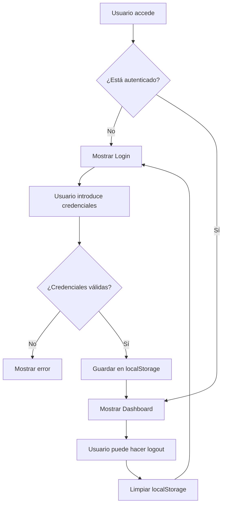

# 🔐 Sistema de Autenticación - Dashboard Financiero

## Descripción General

Se ha implementado un sistema de autenticación completo y elegante para el Dashboard Financiero. El sistema incluye una pantalla de login moderna con efectos visuales atractivos y un control de acceso seguro.

## 🎨 Características del Sistema de Login

### Diseño Visual
- **Glassmorphism**: Efectos de vidrio con backdrop-filter y transparencias
- **Gradientes Dinámicos**: Fondos con gradientes animados y efectos de luz
- **Animaciones Fluidas**: Transiciones suaves usando Framer Motion
- **Responsive Design**: Adaptado para dispositivos móviles y desktop
- **Tipografía Moderna**: Uso de la fuente Inter para mejor legibilidad

### Funcionalidades
- **Autenticación Persistente**: Guarda la sesión en localStorage
- **Roles de Usuario**: Soporte para diferentes tipos de usuario (admin, user, viewer)
- **Credenciales Demo**: Incluye usuarios predefinidos para pruebas
- **Notificaciones**: Toast messages para feedback de acciones
- **Protección de Rutas**: Solo usuarios autenticados pueden acceder al dashboard

## 👤 Credenciales de Prueba

### Administrador
- **Email**: `admin@inovitz.com`
- **Contraseña**: `admin123`
- **Rol**: Administrador
- **Permisos**: Acceso completo al dashboard

### Usuario Regular
- **Email**: `user@buzzword.com`
- **Contraseña**: `user123`
- **Rol**: Usuario
- **Permisos**: Acceso estándar al dashboard

### Visualizador
- **Email**: `viewer@empresa.com`
- **Contraseña**: `viewer123`
- **Rol**: Visualizador
- **Permisos**: Solo visualización de datos

## 🔧 Arquitectura Técnica

### Componentes Principales

#### 1. AuthContext (`src/contexts/AuthContext.tsx`)
- Manejo global del estado de autenticación
- Almacenamiento en localStorage para persistencia
- Funciones de login/logout
- Verificación automática de sesión al cargar

#### 2. Login (`src/components/Login.tsx`)
- Interfaz de usuario para el formulario de login
- Validación de campos
- Integración con credenciales demo
- Diseño glassmorphism con animaciones

#### 3. ProtectedRoute (`src/components/ProtectedRoute.tsx`)
- Componente wrapper para proteger rutas
- Redirige a login si no hay autenticación
- Pantalla de carga durante verificación

#### 4. FinancialHeader (`src/components/FinancialHeader.tsx`)
- Header con información del usuario
- Botón de logout
- Badge con rol del usuario
- Integración con el contexto de autenticación

### Flujo de Autenticación



## 🚀 Características de Seguridad

### Validación de Datos
- Validación de formato de email
- Verificación de campos obligatorios
- Sanitización de entradas

### Gestión de Sesión
- Tokens persistentes en localStorage
- Verificación automática al recargar página
- Limpieza segura al hacer logout

### Protección de Rutas
- Middleware de autenticación
- Redirección automática para usuarios no autenticados
- Preservación de estado durante la navegación

## 🎯 Mejoras Futuras

### Autenticación Avanzada
- [ ] Integración con OAuth (Google, Microsoft)
- [ ] Autenticación de dos factores (2FA)
- [ ] Reset de contraseñas por email
- [ ] Expiración automática de sesiones

### Gestión de Usuarios
- [ ] Panel de administración de usuarios
- [ ] Invitaciones por email
- [ ] Historial de sesiones
- [ ] Auditoría de accesos

### Seguridad Adicional
- [ ] Encriptación de datos sensibles
- [ ] Rate limiting para intentos de login
- [ ] Detección de dispositivos sospechosos
- [ ] Logs de seguridad

## 📱 Experiencia de Usuario

### Desktop
- Pantalla centrada con efectos visuales
- Formulario optimizado para teclado
- Credenciales demo fácilmente accesibles

### Mobile
- Diseño responsive adaptado
- Touch-friendly buttons
- Teclado optimizado para campos de email

### Accesibilidad
- Navegación por teclado
- Labels apropiados para screen readers
- Contraste de colores optimizado
- Focus states visibles

## 🔄 Actualización y Despliegue

El sistema se ha desplegado exitosamente en:
- **GitHub Pages**: https://luisluna99.github.io/financial-dashboard/
- **Desarrollo Local**: http://localhost:3000/financial-dashboard

### Comandos de Desarrollo
```bash
# Iniciar en modo desarrollo
npm start

# Construir para producción
npm run build

# Desplegar a GitHub Pages
git add . && git commit -m "Update" && git push origin main
```

---

**Fecha de Implementación**: 22 de Junio de 2025  
**Versión**: 2.0.0  
**Desarrollador**: Luis Luna  
**Estado**: ✅ Activo y Funcional
